# Top 28 Managed Web Hosting Providers in 2025 (Latest Updated)

Finding reliable managed hosting for your business website means choosing between dozens of providers claiming superior uptime, blazing speeds, and expert support. This review examines 28 hosting platforms that actually deliver on infrastructure quality, server performance, and technical assistance—saving you from costly downtime and migration headaches when your site scales beyond basic shared hosting limits.

***

## **[Liquid Web](https://liquidweb.com)**

Premium managed hosting built for mission-critical applications requiring guaranteed uptime and enterprise-level support.

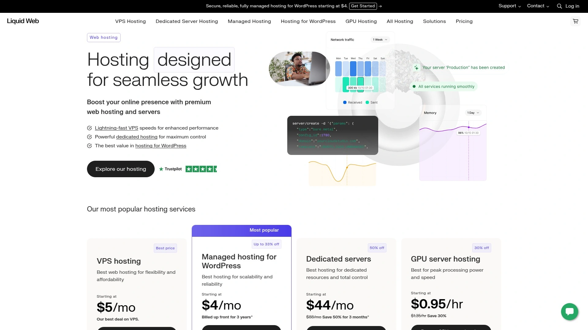

Liquid Web operates cloud-based infrastructure across multiple data centers with fully managed VPS, dedicated servers, and specialized WordPress hosting. Their "Heroic Support" team handles server maintenance, security patches, DDoS protection, and performance optimization 24/7, allowing development teams to focus on application logic rather than infrastructure management.

**Core Infrastructure:** 2-16 vCPU cores, 2-32GB RAM, 40-200GB SSD storage with 10TB monthly bandwidth on baseline plans. All configurations include dedicated IP addresses, Cloudflare CDN integration, and choice of cPanel, Plesk, or InterWorx control panels.

**Management Level:** Complete server administration covering OS updates, firewall configuration, backup automation via Acronis, and threat monitoring through integrated detection systems. Root access remains available for custom deployments while maintaining managed service coverage.

**Performance Guarantees:** 100% network uptime SLA backed by redundant power systems and multi-location failover capabilities. Independent testing shows response times faster than AWS and Rackspace equivalents at comparable price points.

**Ideal Deployment Scenarios:** E-commerce platforms processing high transaction volumes, SaaS applications requiring consistent resource allocation, development agencies managing multiple client projects, and content sites experiencing traffic spikes during product launches.

***

## **[Hostinger](https://www.hostinger.com)**

Budget-friendly cloud hosting with AI-powered site building tools and global server distribution.

Hostinger combines low entry pricing with enterprise-grade features including automated backups, malware scanning, and integrated CDN across shared, VPS, and cloud hosting tiers. Their hPanel control system simplifies domain management, SSL deployment, and one-click CMS installations for non-technical users.

**Resource Allocation:** Plans scale from 1GB RAM on shared hosting to 16GB on managed VPS with NVMe storage and up to 12TB monthly bandwidth. All tiers include weekly backups upgradable to daily snapshots.

**Speed Optimization:** LiteSpeed caching, HTTP/3 protocol support, and strategically located data centers across North America, Europe, and Asia-Pacific deliver sub-200ms load times for target audiences.

**Developer Features:** Git integration, SSH access, WP-CLI for command-line WordPress management, and staging environments on business plans. Free domain registration and unlimited SSL certificates included with annual commitments.

**Best For:** Startups launching first websites, bloggers monetizing content, small businesses needing professional email hosting, and developers prototyping applications before VPS migration.

***

## **[SiteGround](https://www.siteground.com)**

Google Cloud-powered hosting optimized for WordPress with proprietary caching technology.

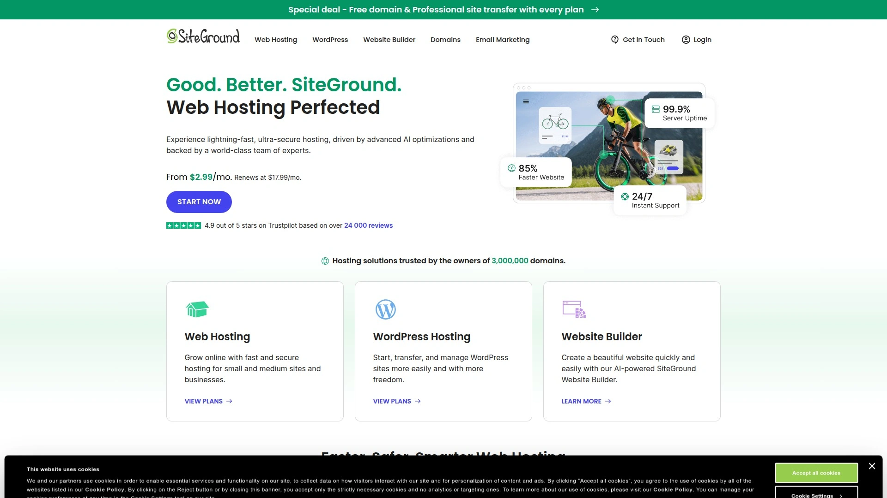

SiteGround builds on Google Cloud infrastructure while adding custom speed layers through SuperCacher, server-level optimization rules, and WordPress-specific configurations. Their managed service includes automatic core updates, staging tools, and Git-based deployment workflows.

**Technical Specifications:** 10-40GB SSD storage, handling 10,000-100,000 monthly visits depending on tier, with unlimited databases and auto-scaling during traffic surges. Four global regions ensure proximity to European, Asian, Australian, and North American visitors.

**Security Infrastructure:** Free Wildcard SSL, daily backups retained for 30 days, AI-powered anti-bot systems, and custom WAF rules protecting against injection attacks. Proactive server monitoring identifies resource issues before affecting site availability.

**Collaboration Tools:** Team management features, white-label client access, and multi-site administration from unified dashboard suitable for agencies.

**Recommended Usage:** Established WordPress sites outgrowing basic shared hosting, online stores requiring PCI compliance, membership platforms with dynamic content, and businesses prioritizing support quality over absolute lowest pricing.

---

## **[ScalaHosting](https://www.scalahosting.com)**

Self-healing cloud VPS with proprietary SPanel management interface and anytime money-back guarantee.

ScalaHosting differentiates through SPanel, a cPanel alternative built specifically for cloud environments with features voted on by user community through their Cloud Democracy program. Managed VPS plans include end-user live chat support, reducing agency workload when managing client accounts.

**Cloud Architecture:** Auto-scaling resources from 2-8 vCPU cores, 2-16GB RAM, and 50-200GB NVMe storage distributed across redundant nodes. Disaster recovery systems maintain site copies in multiple geographic locations.

**Unique Advantages:** Self-healing technology automatically detects and resolves common server issues without manual intervention. Free site migrations for unlimited websites handled by senior technicians.

**Control Options:** Full root SSH access for developers alongside graphical interface for content managers. Compatible with major e-commerce platforms including OpenCart official recommendations.

**Target Market:** Online retailers depending on site revenue, digital agencies hosting client portfolios, membership sites requiring guaranteed uptime, and businesses transitioning from shared hosting to cloud infrastructure.

---

## **[DreamHost](https://www.dreamhost.com)**

Independently operated hosting company offering managed WordPress with optional professional site building service.

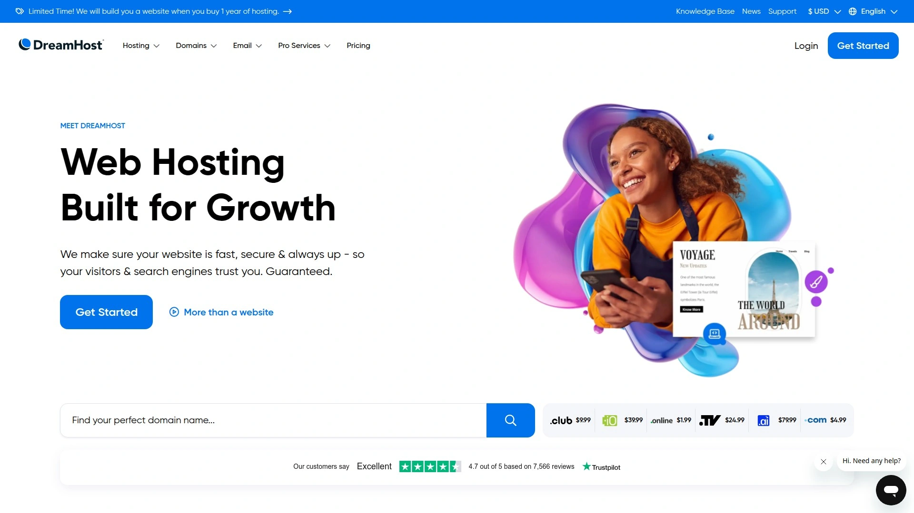

DreamHost provides managed WordPress environments with pre-configured performance tuning, automated migrations, and optional white-glove setup where their team builds complete websites based on client specifications. AI business advisor and content generation tools assist with strategy and copywriting.

**Platform Resources:** Unlimited traffic on all plans, 30-240GB SSD storage, and 1-8GB RAM allocation depending on VPS tier. Free automated SSL through Let's Encrypt, unlimited email accounts, and 100% uptime guarantee.

**Management Approach:** Fully managed servers handling security patches, WordPress core updates, and infrastructure monitoring. Custom panel interface designed for simplicity over advanced technical controls.

**Deployment Flexibility:** Choose between Apache and Nginx server software with support for PHP, Python, Node.js, Ruby, and Perl environments. Reseller features allow creating unlimited sub-accounts for team or client access.

**Optimal Applications:** Creative professionals building portfolio sites, bloggers focusing on content over technical management, small businesses wanting hands-off hosting, and anyone preferring to outsource website construction entirely.

---

## **[Bluehost](https://www.bluehost.com)**

WordPress-focused hosting with free educational academy and direct WordPress.org endorsement.

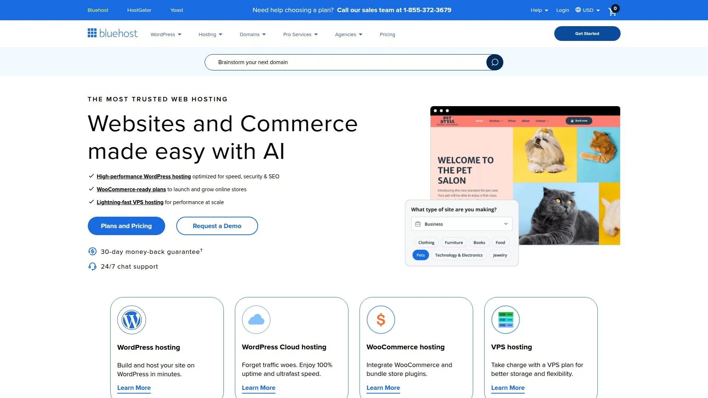

Bluehost invests heavily in WordPress ecosystem through code contributions, event sponsorships, and their WordPress Academy offering free courses on site building, plugin usage, and SEO optimization. Pre-installed WordPress, migration tools, and free Yoast SEO plugin streamline setup.

**Capacity Planning:** Handles up to 100 concurrent visitors with estimated 40,000 monthly pageviews on base plans. Unmetered bandwidth, automatic WordPress updates, and integrated CDN included.

**Security Features:** Free SSL certificates, anti-DDoS protection, malware scanning, and SSH/WP-CLI access for developers. Managed updates minimize plugin conflicts.

**Performance Metrics:** Testing shows 100% uptime, above-average LCP scores, and capability handling 15 concurrent requests per second. Migration to Oracle Cloud infrastructure promises further speed improvements.

**Best Suited For:** WordPress beginners leveraging educational resources, content creators optimizing for search visibility, small sites prioritizing learning curve over advanced features, and users wanting WordPress community-supported hosting.

***

## **[HostGator](https://www.hostgator.com)**

Long-standing shared and VPS provider with traditional cPanel management and phone support availability.

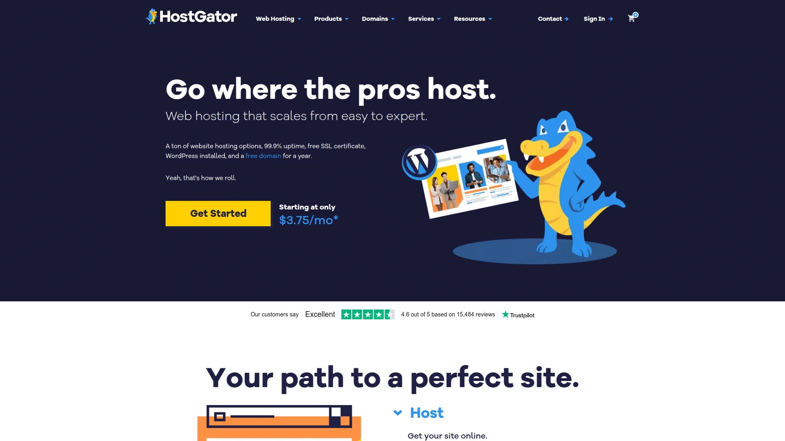

HostGator maintains conventional hosting approach using cPanel control panels, unmetered bandwidth, and one of few remaining phone support lines for customers preferring voice assistance. Tier 3 data centers and free cPanel migrations simplify transitions from other hosts.

**Server Specifications:** Semi-managed VPS with 2-8 vCPU cores, 2-8GB RAM, 40-240GB SSD storage, and unlimited website hosting. DDoS protection, weekly backups, and dedicated IPs standard across plans.

**Scalability Path:** Easy upgrades from shared to VPS to dedicated hosting as sites grow, all manageable through familiar cPanel interface. Supports 25,000+ monthly visitors on baseline shared plans.

**Integration Ecosystem:** One-click installs for WordPress and 75+ applications, CodeGuard backup integration, SiteLock security scanning, and Google Workspace compatibility.

**Recommended For:** US-based businesses wanting phone support, sites transitioning from other cPanel hosts, users preferring proven technology over newest innovations, and projects requiring straightforward shared hosting without complexity.

---

## **[InMotion Hosting](https://www.inmotion.com)**

Managed and unmanaged VPS with 90-day guarantee and 2-hour launch assistance included.

InMotion differentiates through extended money-back period, complimentary launch assist providing 2 hours of expert configuration help, and NVMe SSD storage for faster database operations. Armed physical security at data centers adds protection for sensitive business data.

**Infrastructure Options:** Both managed VPS with cPanel preinstalled and unmanaged cloud VPS for command-line administration. Managed plans include unlimited websites, email accounts, and bandwidth.

**Resource Ranges:** 2-32GB RAM, 4-8 CPU cores, 75-640GB SSD/NVMe storage depending on managed versus unmanaged selection. Minimum 2 dedicated IP addresses per VPS plan.

**Support Structure:** 24/7 US-based phone, chat, and ticket assistance with senior technicians available for complex migrations. Additional launch assist blocks purchasable in 2-hour increments.

**Ideal Customers:** Businesses requiring extended trial periods before commitment, sites needing migration assistance from specialized environments, agencies wanting mix of managed client sites and unmanaged development servers, and companies prioritizing data center physical security.

***

## **[A2 Hosting](https://www.a2hosting.com)**

Turbo server technology with choice of managed or unmanaged VPS configurations.

A2 Hosting's Turbo servers use LiteSpeed web server software and optimized caching delivering up to 20x faster page loads compared to standard Apache configurations. Both managed and unmanaged VPS options accommodate different technical skill levels.

**Performance Hardware:** 1-8 CPU cores, 150-450GB SSD or NVMe storage, 1-32GB RAM with managed plans including cPanel and full maintenance. Unmanaged servers provide root access for custom OS installations.

**Speed Optimizations:** Pre-configured HTTP/2, PHP 8.x, MariaDB database optimization, and server-level caching reducing database queries. Choice of datacenter location influences latency for target markets.

**Flexibility Balance:** Managed VPS simplifies scaling through control panel while maintaining root access for advanced customization. Unmanaged VPS offers command-line control with optional cPanel quick-install.

**Best Applications:** WordPress sites requiring maximum speed, developers wanting root access without sacrificing support, agencies managing mixed technical skill clients, and e-commerce platforms optimizing checkout conversion through faster loading.

---

## **[GreenGeeks](https://www.greengeeks.com)**

Environmentally focused hosting powered by 300% renewable energy credits.

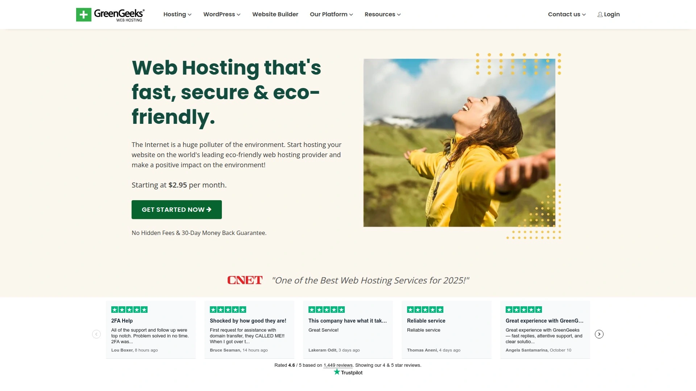

GreenGeeks operates carbon-reducing infrastructure purchasing three times the power consumption in wind energy credits, appealing to environmentally conscious businesses. Fully managed VPS includes cPanel, root access, and comprehensive security monitoring.

**Green Credentials:** EPA Green Power Partner certification, carbon offset programs, and energy-efficient cooling systems in data centers. Suitable for brands emphasizing sustainability in marketing.

**Technical Capacity:** 4-6 vCPU cores, 2-8GB RAM, 50-150GB SSD storage with 10TB bandwidth. CentOS Linux pre-installed with custom security rules and WAF protection.

**Management Coverage:** 24/7 server monitoring, automated security updates, DDoS mitigation, and dedicated IP addresses. Free SSL certificates and nightly backups included.

**Target Audience:** Eco-conscious brands highlighting environmental responsibility, nonprofits with sustainability missions, businesses pursuing B Corp certification, and standard commercial sites wanting managed VPS with green operations.

---

## **[Namecheap](https://www.namecheap.com)**

Domain registrar expanded into value-priced hosting with modular service options.

Namecheap bundles hosting, domains, SSL, email, and CDN services allowing pick-and-choose combinations for different projects under single account management. Unmanaged VPS plans start exceptionally low for technical users comfortable with command-line administration.

**Pricing Structure:** Shared hosting from $1.98/month first year, $4.48/month renewal with AI site builder and 30 email accounts. VPS plans start $15.88/month with 4 vCPU and 6GB RAM.

**Service Integration:** Centralized dashboard managing domains, hosting, email, security tools, and marketing services across multiple projects. Free domain privacy protection included with registrations.

**Technical Level:** Primarily suited for developers willing to handle server configuration on VPS plans. Shared hosting includes one-click WordPress installer for less technical users.

**Recommended Usage:** Developers managing multiple client projects with varying requirements, businesses consolidating domain and hosting billing, budget-conscious startups, and technical users wanting unmanaged VPS savings.

---

## **[IONOS](https://www.ionos.com)**

German hosting giant with US and European data centers offering customizable dedicated servers.

IONOS provides enterprise-level infrastructure at competitive pricing through configurable dedicated servers with Intel Xeon and AMD processors, ISO 27001 certified data centers, and unlimited traffic on most plans. Personal consultant support assists with complex configurations.

**Hardware Flexibility:** Dedicated servers with up to 48TB RAID-protected storage, 1Gbps bandwidth, DDoS protection, and IP firewall. VPS plans offer high customization of RAM, CPU cores, and storage combinations.

**Security Compliance:** Certifications supporting GDPR, HIPAA, and PCI-DSS requirements for regulated industries. Multi-factor authentication, advanced firewalls, and automated backups standard.

**Geographic Coverage:** Four US data center locations plus five European regions ensuring data sovereignty compliance and reduced latency for international audiences.

**Best For:** European businesses requiring GDPR compliance, enterprises needing certified security standards, resource-intensive applications requiring dedicated hardware, and budget-conscious companies wanting enterprise features without premium pricing.

***

## **[DigitalOcean](https://www.digitalocean.com)**

Developer-focused cloud platform with transparent pricing and extensive documentation.

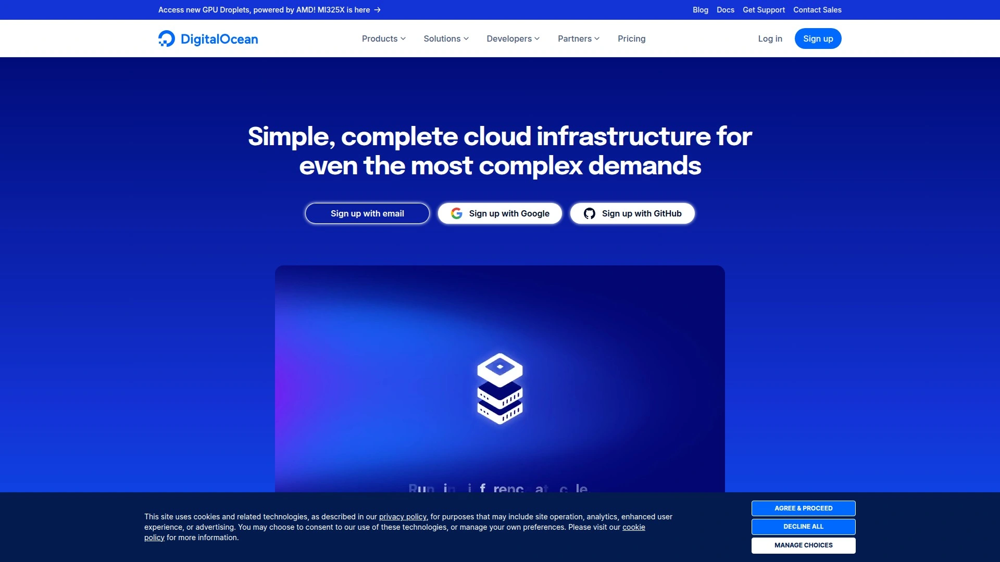

DigitalOcean targets developers through simple API, comprehensive tutorials, one-click application deployments, and predictable billing without hidden bandwidth charges. Flat-rate pricing and strong documentation reduce learning curve for cloud infrastructure.

**Cloud Resources:** Droplets (VPS instances) from $4/month, scalable compute, managed databases, object storage, and Kubernetes clusters. IPv6 support and startup scripts for automation.

**Developer Tools:** GitHub integration, team collaboration features, monitoring dashboards, and command-line tools for infrastructure-as-code deployments. Extensive community tutorials covering common scenarios.

**Limitations:** No Windows server support, paid support tiers for priority assistance, and billed bandwidth on higher-tier plans. Best suited for Linux-based applications.

**Ideal Users:** Startup development teams, developers learning cloud infrastructure, Linux-based SaaS applications, and technical users prioritizing documentation quality and API access over managed support.

---

## **[Vultr](https://www.vultr.com)**

High-frequency compute instances across 32 global data center locations.

Vultr operates extensive geographic coverage with high-frequency compute options delivering faster processing for CPU-intensive applications. Fast deployment times and global reach suit distributed applications.

**Infrastructure Scale:** 32 worldwide data centers enabling multi-region deployments, DDoS protection, IPv6 addressing, and startup script automation. Bare metal servers available for maximum performance.

**Compute Options:** Standard, high-frequency, and GPU-accelerated instances. Block storage, object storage, and managed databases complement compute resources.

**Pricing Model:** Hourly billing with bandwidth included up to allocation limits, then billed overage. Windows server support with licensing included in pricing.

**Target Market:** Applications requiring specific geographic presence, CPU-intensive workloads benefiting from high-frequency processors, Windows server deployments, and businesses needing rapid global scaling.

---

## **[Kamatera](https://www.kamatera.com)**

Fully customizable cloud infrastructure with real-time provisioning and granular resource control.

Kamatera allows complete server specification customization choosing exact CPU cores, RAM amounts, and storage configurations without tier restrictions. Resources provision within minutes for rapid deployment.

**Customization Depth:** Select specific CPU counts, RAM in 1GB increments, storage type and size, and network configuration. Pay-as-you-go or monthly billing options.

**Support Accessibility:** Real-time chat and phone support with technical specialists assisting configuration decisions. No tiered support—all customers access same assistance level.

**Infrastructure Gaps:** Outdated UI requiring learning curve, no included data transfer requiring bandwidth calculation, and lack of automated migration tools.

**Best Applications:** Projects requiring precise resource matching, businesses avoiding over-provisioning costs, applications with variable resource needs, and users wanting granular control over infrastructure specifications.

---

## **[Cloudways](https://www.cloudways.com)**

Managed cloud hosting platform layered over AWS, Google Cloud, DigitalOcean, Vultr, and Linode.

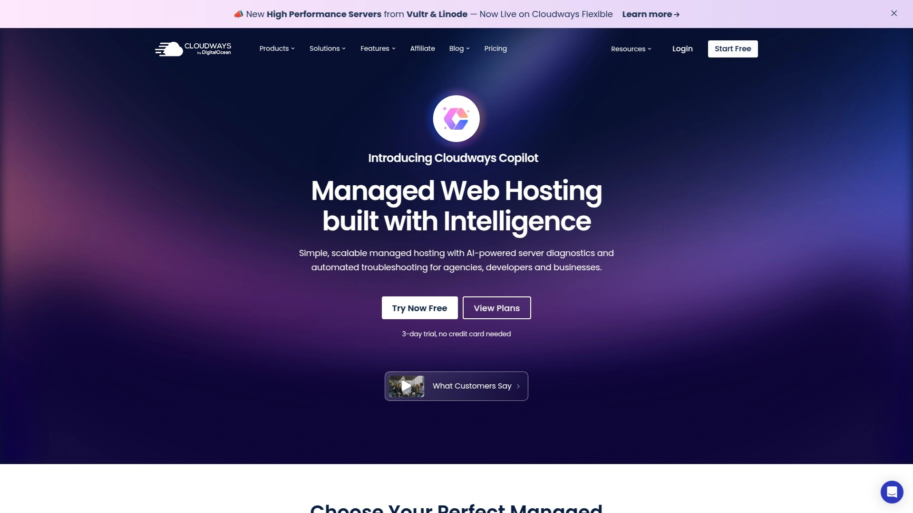

Cloudways simplifies major cloud platforms by adding managed layer with easy control panel, automated backups, caching, and support team. Choose underlying infrastructure provider while Cloudways handles technical management.

**Platform Flexibility:** Deploy on AWS, Google Cloud, DigitalOcean, Vultr, or Linode infrastructure through unified Cloudways interface. Switch providers without changing management workflow.

**Managed Features:** Automated backups, advanced caching mechanisms, free SSL installation, staging environments, and Git integration. Team collaboration and client access controls.

**Performance Tools:** Built-in CDN, Redis caching, Varnish cache, and Memcached for database query optimization. Server monitoring with resource usage alerts.

**Recommended For:** Agencies wanting managed cloud without learning AWS complexity, developers preferring application focus over server administration, WordPress sites requiring enterprise infrastructure, and businesses wanting cloud benefits with traditional hosting simplicity.

---

## **[Atlantic.Net](https://www.atlantic.net)**

Compliance-focused dedicated hosting with 30+ years experience and US-based support.

Atlantic.Net specializes in healthcare and financial industry hosting requiring HIPAA, PCI-DSS, HITECH compliance with SOC 2 and SOC 3 certifications. Custom-built servers across five US strategic locations.

**Regulatory Expertise:** Compliance consulting, BAA agreements for healthcare, PCI scanning services, and audit-ready infrastructure documentation. Dedicated compliance specialists available.

**Hardware Configuration:** Latest Intel Xeon processors, customizable RAM and storage, complete root access, dedicated IPs, and SSL certificates included. No setup fees with discounts for longer commitments.

**Support Quality:** 24/7 US-based English and Spanish support, 100% SLA, and comprehensive managed services including DDoS protection.

**Target Industries:** Healthcare providers managing patient data, financial services requiring PCI compliance, legal firms with confidentiality requirements, and regulated industries needing certified infrastructure.

---

## **[Hostwinds](https://www.hostwinds.com)**

Fully customizable dedicated servers with global presence and IPMI access.

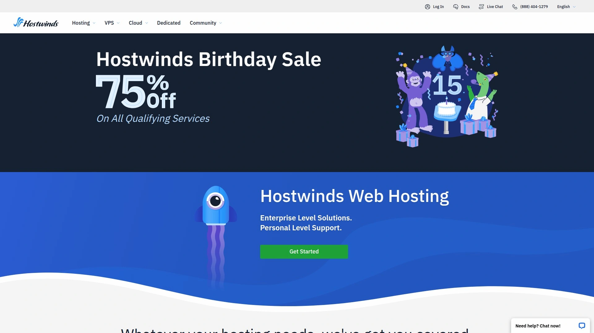

Hostwinds offers extensive dedicated server customization with configurable RAID arrays, choice of data center location across Seattle, Dallas, and Amsterdam, and full IPMI access for remote management. 100% resource ownership ensures consistent performance.

**Technical Specifications:** Customizable RAM configurations, multiple CPU options, RAID protection choices, and unlimited bandwidth. Both managed and unmanaged dedicated hosting available.

**Performance Consistency:** Dedicated resources never shared, eliminating noisy neighbor effects common in VPS environments. Suitable for predictable performance requirements.

**Management Options:** Fully managed including OS updates and security patches, or unmanaged for complete control. cPanel and WHM available as optional additions.

**Ideal For:** Machine learning workloads requiring consistent CPU, game server hosting, big data processing, high-traffic applications, and businesses needing guaranteed resource availability without cloud variability.

---

## **[Linode (Akamai)](https://www.linode.com)**

Developer-friendly cloud VPS with predictable pricing and strong Linux support.

Linode focuses on Linux-based cloud hosting with straightforward pricing, excellent documentation, and developer-oriented features. Recently acquired by Akamai, benefiting from expanded network infrastructure.

**Cloud Infrastructure:** SSD-backed instances, managed Kubernetes, object storage, and cloud firewalls. One-click app deployments for common frameworks.

**Developer Experience:** API-first design, extensive CLI tools, Infrastructure-as-Code support, and detailed guides for complex setups. Active community forums.

**Network Advantages:** Akamai's global CDN and edge network integration improving content delivery speeds. DDoS protection included across plans.

**Best Suited For:** Linux developers, containerized applications, API-driven infrastructure deployments, and technical teams comfortable with cloud-native architectures preferring Linode's approach over larger hyperscale providers.

***

## **[InterServer](https://www.interserver.net)**

Affordable dedicated hosting with price-lock guarantee and weekly billing options.

InterServer guarantees renewal pricing matches initial rates protecting against typical industry price increases after promotional periods. Flexible billing including weekly options accommodates cash flow management.

**Server Options:** Dedicated servers from $70-$363/month with extensive customization options. Suitable for resource-intensive applications requiring dedicated hardware.

**Pricing Transparency:** Price-lock guarantee prevents renewal surprises common with other hosts. No hidden fees or forced upgrades.

**Technical Capabilities:** Full root access, choice of operating systems, optional control panels, and scalable resources. Both self-managed and managed options available.

**Target Customers:** Budget-conscious businesses wanting dedicated resources, applications requiring custom server environments, long-term projects benefiting from price stability, and users frustrated by typical hosting price escalations.

---

## **[Hetzner](https://www.hetzner.com)**

European hosting provider known for competitive pricing and powerful dedicated servers.

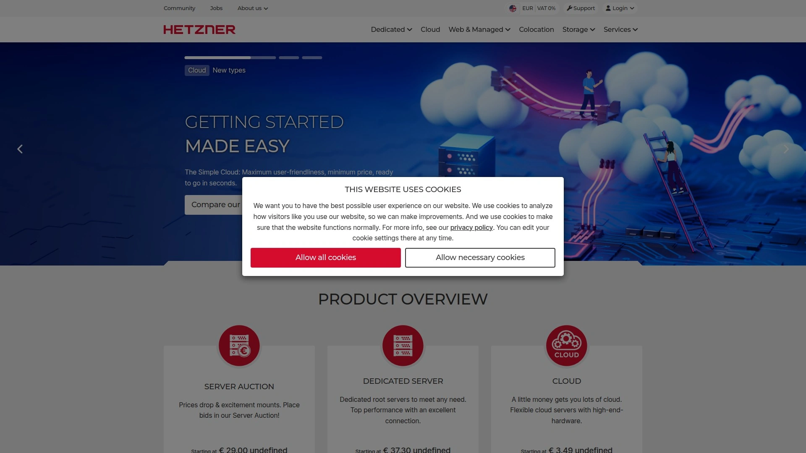

Hetzner operates primarily European data centers with exceptional price-to-performance ratios on dedicated server configurations. Particularly strong presence in German and Finnish markets.

**Value Proposition:** Significantly lower pricing than US equivalents for comparable dedicated hardware. Auctions for previous-generation servers offer further savings.

**Infrastructure:** High-performance dedicated servers, cloud instances, and storage boxes. Strong network infrastructure within Europe.

**Geographic Considerations:** Primary data centers in Germany and Finland suit European audience targeting. Limited presence outside Europe affects global latency.

**Best For:** European businesses, applications serving EU audiences, budget-focused dedicated server needs, and users comfortable with European data privacy regulations and primary support during European business hours.

---

## **[Oracle Cloud](https://www.oracle.com/cloud)**

Enterprise cloud platform optimized for Oracle database integration and hybrid environments.

Oracle Cloud excels in scenarios requiring Oracle database integration, offering seamless connectivity and optimized performance for Oracle-dependent applications. Strong enterprise features and regulatory compliance.

**Database Strength:** Native Oracle database support with autonomous database options, high-performance interconnects, and Oracle RAC capabilities. MySQL and PostgreSQL also supported.

**Security Posture:** Designed for regulated industries with compliance certifications, data encryption, and isolated network virtualization. Suitable for finance and healthcare sectors.

**Learning Curve:** More complex than simplified cloud providers, requiring deeper technical knowledge. Best for teams with enterprise infrastructure experience.

**Target Market:** Enterprises running Oracle databases, large corporations with hybrid cloud strategies, regulated industries requiring robust compliance, and organizations migrating from on-premise Oracle environments.

---

## **[Serverspace](https://serverspace.us)**

US-focused cloud VPS provider emphasizing simplicity and customer service.

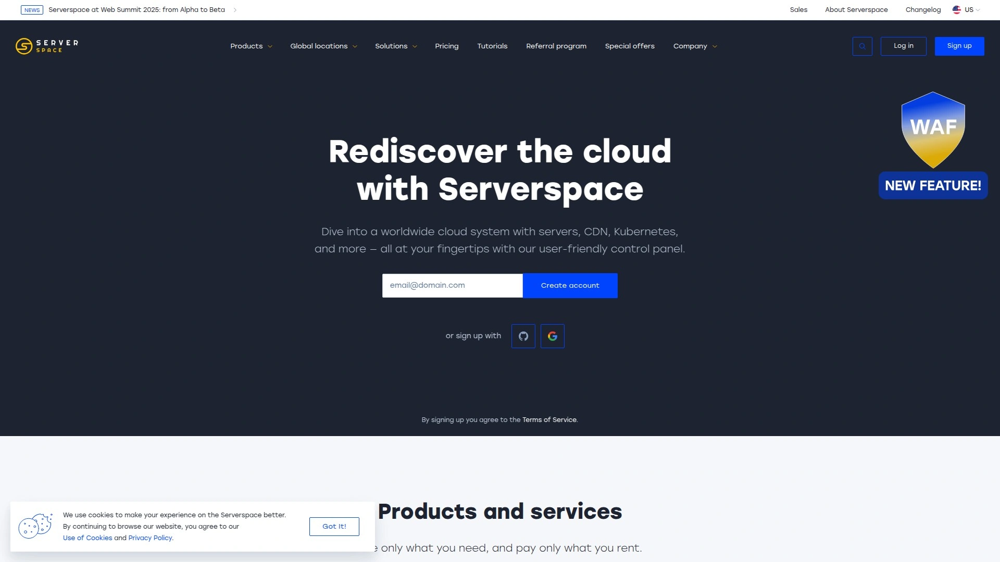

Serverspace targets small to medium businesses needing reliable cloud VPS without complexity of hyperscale providers. Straightforward pricing and responsive support differentiate from larger competitors.

**Service Approach:** Simplified cloud hosting with emphasis on customer relationships over massive scale. Direct access to technical team.

**Infrastructure:** Cloud VPS instances, load balancers, and backup solutions across US data centers. Focus on essential features over extensive service catalog.

**Support Philosophy:** Personalized assistance rather than tiered support levels. Suitable for businesses valuing relationship-based service.

**Recommended For:** SMBs wanting personalized cloud hosting support, businesses migrating from shared hosting to cloud VPS, companies preferring smaller providers over enterprise giants, and US-based operations prioritizing domestic support.

---

## **[OVHcloud](https://www.ovhcloud.com)**

French cloud provider with extensive European infrastructure and competitive pricing.

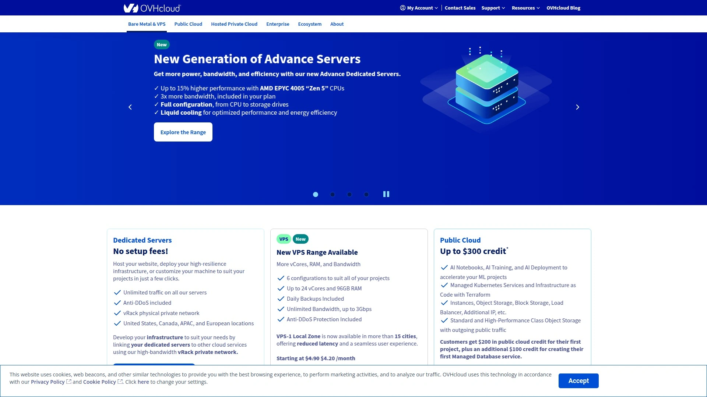

OVHcloud operates one of Europe's largest hosting infrastructures with data centers across multiple continents. Known for competitive dedicated server pricing and bare metal cloud options.

**Scale:** Massive infrastructure supporting dedicated servers, public cloud, private cloud, and hybrid solutions. Strong presence in European and Canadian markets.

**Bare Metal Cloud:** Combines dedicated server performance with cloud flexibility allowing rapid provisioning of dedicated hardware. Anti-DDoS protection included across services.

**Regional Strength:** Extensive European data center network ensuring data residency compliance for EU regulations. Growing North American presence.

**Best Applications:** European enterprises, applications requiring EU data sovereignty, high-performance computing workloads, and businesses wanting dedicated server power with cloud provisioning speed.

---

## **[GoDaddy](https://www.godaddy.com)**

Domain registrar offering entry-level VPS with simplified setup and included SSL.

GoDaddy's VPS hosting emphasizes ease of use for small businesses upgrading from shared hosting. Includes SSL certificates and dedicated IP with straightforward setup process.

**Ease of Access:** Simplified control panel, guided setup wizards, and integrated domain management. Less intimidating for non-technical users.

**Resource Limits:** More modest specifications compared to specialized VPS providers. Suitable for smaller sites not requiring maximum performance.

**Scalability Constraints:** Limited growth path beyond basic VPS tiers. Migration necessary when outgrowing GoDaddy's offerings.

**Target Users:** Small businesses managing domains and hosting together, non-technical users upgrading from shared plans, simple sites not requiring advanced features, and users prioritizing brand familiarity over specialized hosting.

---

## **[Tencent Cloud](https://www.tencentcloud.com)**

Chinese cloud provider with strong Asia-Pacific presence and gaming infrastructure.

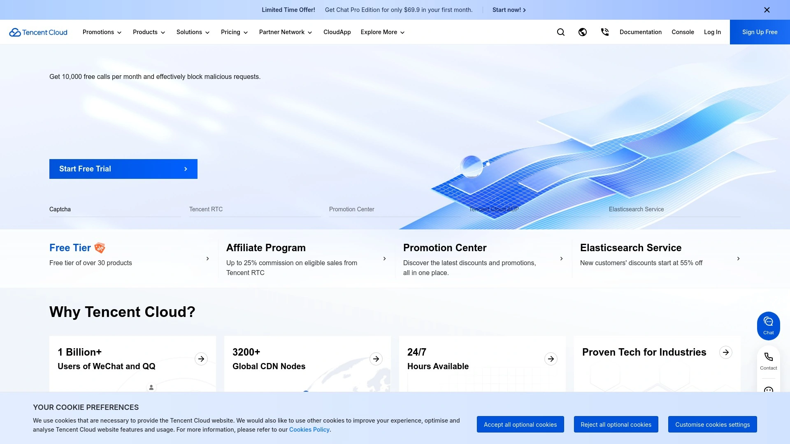

Tencent Cloud leverages parent company's gaming and social media infrastructure offering specialized solutions for similar applications. Extensive presence across Asian markets.

**Regional Coverage:** Data centers throughout Asia-Pacific, Europe, and North America with particularly strong Chinese infrastructure. Supports compliance with Chinese data regulations.

**Specialized Services:** Gaming-specific hosting, live streaming infrastructure, and social application backends leveraging Tencent's operational experience. AI and big data services.

**Market Position:** Ideal for businesses entering Chinese markets or serving Asian audiences. Less established in Western markets compared to AWS/Azure/GCP.

**Best For:** Applications targeting Chinese users, gaming companies, live streaming platforms, businesses expanding into Asian markets, and companies needing infrastructure within China's regulatory framework.

***

## **[Vercel](https://www.vercel.com)**

Frontend-focused cloud platform optimized for Next.js and modern JavaScript frameworks.

Vercel specializes in hosting JavaScript applications with zero-configuration deployments, automatic scaling, and edge network distribution. Built by creators of Next.js framework.

**Framework Optimization:** Native Next.js support, automatic builds from Git repositories, and optimized bundling for performance. Also supports React, Vue, Angular, and static sites.

**Developer Experience:** Git integration triggers automatic deployments, preview URLs for every commit, and serverless function support. No server configuration needed.

**Edge Network:** Global edge caching ensures fast loading worldwide. Automatic HTTPS and DDoS protection included.

**Ideal Projects:** Next.js applications, React-based websites, portfolio sites, marketing pages, e-commerce frontends using headless CMS, and development teams practicing continuous deployment workflows.

---

## **[Render](https://www.render.com)**

Modern cloud platform with automatic deployments and managed databases.

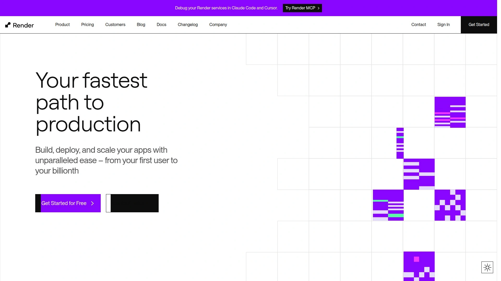

Render provides simplified cloud hosting with Git-triggered deployments, managed PostgreSQL databases, and cron job scheduling without complex configuration. Competes with Heroku's simplicity while offering better pricing.

**Service Offerings:** Web services, static sites, background workers, PostgreSQL databases, and Redis instances. Free SSL and automatic deploys from GitHub/GitLab.

**Ease of Use:** Connect repository, select runtime environment, and Render handles infrastructure provisioning. No DevOps expertise required.

**Scaling:** Automatic horizontal scaling based on traffic, health checks, and zero-downtime deployments.

**Target Audience:** Startups prioritizing speed to market, developers avoiding infrastructure management, side projects needing production-quality hosting, and teams transitioning from Heroku seeking cost savings.

---

## **[Netlify](https://www.netlify.com)**

JAMstack hosting platform with built-in CI/CD and edge functions.

Netlify pioneered JAMstack hosting combining static site generation with serverless functions and edge computing. Automatic builds from Git repositories with instant cache invalidation.

**Core Features:** Continuous deployment from Git, form handling, split testing, and serverless functions. Global CDN with intelligent edge routing.

**Developer Tools:** Build plugins ecosystem, deploy previews for pull requests, and rollback capabilities. Integration with headless CMS platforms.

**Performance:** Pre-built sites serve from edge network ensuring sub-100ms response times globally. Automatic asset optimization.

**Best Use Cases:** Static websites, JAMstack applications, documentation sites, marketing pages, blogs using static generators (Gatsby, Hugo, Jekyll), and teams practicing Git-based workflows.

---

## What factors determine managed hosting quality?

Server uptime guarantees backed by SLA credits demonstrate provider confidence in infrastructure reliability. Look for 99.9% minimum commitments with financial compensation when thresholds aren't met, indicating serious investment in redundant systems and monitoring. Support response times matter more than 24/7 availability claims—test ticket systems during evaluation periods to confirm actual expertise levels and resolution speeds.

## How much RAM does a business website actually need?

Sites receiving under 10,000 monthly visitors typically perform well with 2-4GB RAM on managed VPS configurations. E-commerce platforms processing real-time transactions benefit from 8GB minimum to handle database queries, inventory updates, and payment processing simultaneously without slowdowns. Monitor server resource graphs during peak traffic to identify RAM bottlenecks before upgrading—many hosts allow seamless scaling without migration.

## Can managed hosting improve site speed without code changes?

Server-level caching through Redis, Memcached, or LiteSpeed significantly reduces database queries regardless of application code quality. CDN integration distributes static assets globally, decreasing load times for international visitors by 40-60% in testing scenarios. PHP version upgrades to 8.x and HTTP/2 protocol activation—both managed hosting responsibilities—deliver measurable performance gains without development work.

---

## Conclusion

Selecting managed hosting depends on balancing infrastructure requirements against technical expertise and budget constraints. [Liquid Web](https://liquidweb.com) delivers enterprise-grade performance for mission-critical applications where downtime costs exceed premium hosting investment, particularly when teams lack dedicated server administrators. Their managed approach eliminates infrastructure concerns while maintaining customization flexibility through root access and multiple control panel options.
